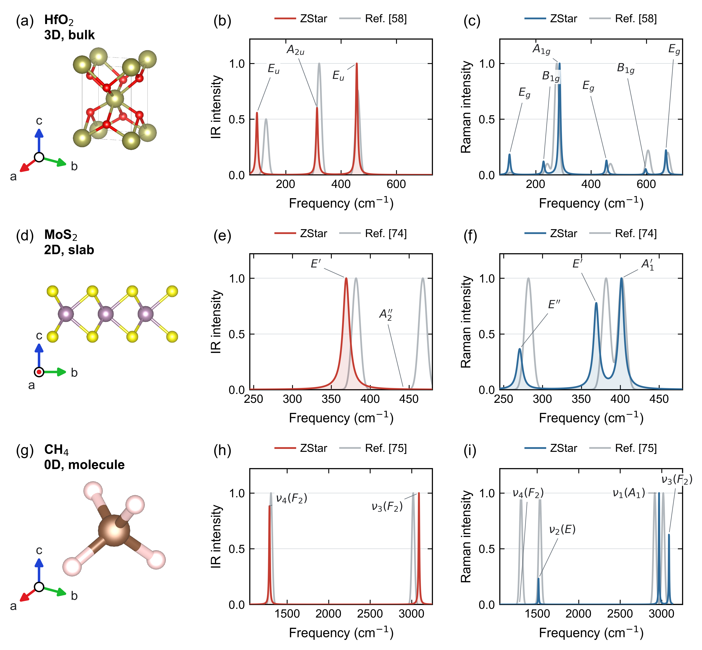
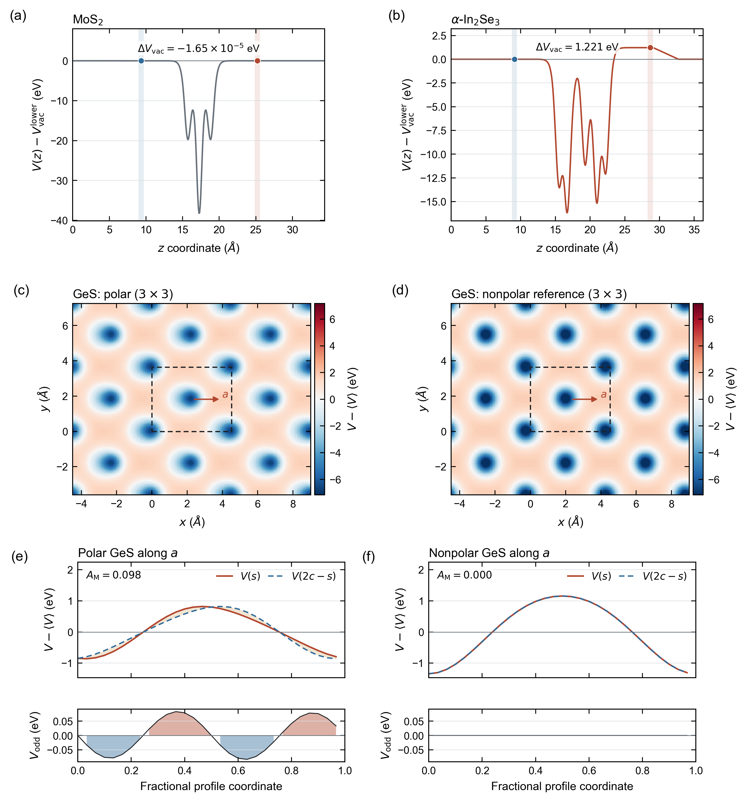

<p align="center">
  
</p>

<h1 align="center">ZStar</h1>

<p align="center">
  An automated toolkit for polarization, Born effective charges, dielectric response, and infrared and Raman spectra calculations.
</p>

<p align="center">
  <a href="https://pypi.org/project/zstar/"></a>
  <a href="https://pypi.org/project/zstar/"></a>
  <a href="LICENSE"></a>
</p>

<p align="center">
  English | <a href="README.zh-CN.md">简体中文</a> |
  <a href="docs/README.en.pdf">English PDF</a> |
  <a href="docs/README.zh-CN.pdf">中文 PDF</a>
</p>

---

## Quick Start

The fastest complete introduction uses the supplied two-atom 3C-SiC case. It
calculates BEC and Gamma-point force constants from the same symmetry-adapted
displacements, then generates IR and Raman spectra. The example includes its
ABACUS inputs, SG15 pseudopotentials, and DZP orbitals.

### 1. Install ZStar and get the example

```bash
git clone --depth 1 https://github.com/xdzhu/zstar.git
cd zstar
python -m pip install .
```

For a package-only installation, use `python -m pip install -U zstar`. The
reproducible examples are available from GitHub rather than the PyPI wheel.

### 2. Configure the calculators

Configure the ABACUS and PYATB executables and the MPI/OMP resources once,
following the [calculator configuration guide](docs/cli_reference.md#calculator-configuration).
Then run `zstar config check`; only ABACUS and PYATB must be available for this
example. Phonopy is installed with ZStar.

### 3. Calculate BEC and Gamma phonons

Create a private working copy so that the supplied inputs and archived results
remain unchanged:

```bash
cd examples/3D_Bulk/SiC
cp -r run work
cd work
```

Prepare and inspect the Unified calculation before starting the solvers, then
run and postprocess it:

```bash
zstar bec pre --stru STRU
zstar bec run --dry-run
zstar bec run
zstar bec stat
zstar bec post
```

`bec pre` creates the reference and symmetry-adapted displacement stages.
`bec run` executes the insulating-state check, ABACUS SCFs, and PYATB
polarization calculations; rerunning it resumes incomplete stages. `bec post`
jointly reconstructs the BEC and Gamma-point force constants and writes
`BEC.dat`, `BORN`, `FORCE_CONSTANTS`, and the mode data.

### 4. Generate the IR and Raman spectra

Use the completed response calculation as the spectroscopy source:

```bash
zstar spectra pre --root spectra --response .
zstar spectra run --root spectra
zstar spectra stat --root spectra
zstar spectra post --root spectra
```

The IR spectrum follows from the mode frequencies and BEC. `spectra run`
evaluates the additional PYATB dielectric responses required for Raman, and
`spectra post` writes the final tables and plots under `spectra/ir/` and
`spectra/raman/`. The retained result gives opposite Si/C BEC values of about
2.70 e and a triply degenerate optical mode near 773 cm^-1. Matching archived
spectra are available under `../results/spectra/`.

After learning the individual stages, `bash run.sh --with-spectra` from the
case directory provides the same workflow as a resumable convenience command.

### 5. Let an agent run the same workflow

Install the packaged agent skill, then open a new agent session:

```bash
zstar skill install
```

Example prompt:

```text
Use $run-zstar-workflows to reproduce the 3C-SiC Quick Start in
examples/3D_Bulk/SiC. Run the preflight first, then execute the zstar bec and
zstar spectra stages individually if ABACUS and PYATB are available. Explain
each stage and report the BEC table, optical-mode frequencies, and spectrum paths.
```

The sections below explain the physical conventions, other dimensionalities,
calculators, scheduler integration, and advanced analysis.

## Workflow overview


The vector version is available as [PDF](docs/paper_figures/unified_workflow.pdf).

## Overview

ZStar automates efficient, symmetry-adapted finite-displacement response
calculations. Its Unified ABACUS + PYATB framework reconstructs Born effective
charges (BECs), Gamma force constants and Raman derivatives from one displacement
set. Polarization, force and electronic dielectric observations yield
infrared (IR), Raman and dielectric responses with explicit accuracy checks.
Additional VASP, CP2K and Quantum ESPRESSO adapters support their documented
response routes; they are complementary to the Unified framework.

The toolkit keeps every stage visible: structures, solver inputs, band-gap gates, polarization values, charge-density data, tensor reconstruction reports, spectra, and progress records remain available for inspection and restart.

Start with the [user manual](docs/README.md) for task-based tutorials, configuration,
examples and capability boundaries.

The numerical checks used for the current release are summarized in [docs/validation.md](docs/validation.md).

The Unified ABACUS + PYATB workflow shares Phonopy-generated
displacements between BEC and Gamma phonons. See the
[Unified BEC/phonon guide](docs/research/shared_response/USAGE.md) and
[matched examples](examples/Benchmarks/README.md) for its theory,
actual-displacement convention, precision safeguards, and validation status.
The [Unified spectroscopy guide](docs/unified_spectroscopy.md) explains how the
same calculations continue to IR and Raman analysis.
The released package and historical examples retain their recorded versions.

The current release includes the Unified framework, short output names, and completed
Separate/Unified benchmarks. Historical examples retain their original provenance.

For mixed displacements, converge the PYATB Berry mesh as well as the SCF and
displacement amplitude. The [direct validation report](docs/research/shared_response/DIRECT_VALIDATION.md)
includes SiC, tetragonal HfO2, and newly relaxed alpha-In2Se3, with raw tensors,
mesh/step diagnostics, and separately accounted CPU core-hours.

### Main capabilities

- Unified BEC/APT, Gamma force constants and static nonresonant Raman derivatives,
  with Separate controls using Cartesian or normal-mode displacements.
- Symmetry reduction, full-cell tensor reconstruction, and acoustic-sum-rule correction.
- A serial, resumable `0.no-move -> displaced structures` execution model.
- Reuse of the converged `0.no-move` charge density for every displacement.
- One-time insulating-state check after the reference SCF.
- Shell, Slurm, and Torque driver generation.
- Automatic compatibility with legacy and direct-static-response PYATB versions.
- A serial, resumable CP2K backend for Berry-phase BEC tensors and native APT checks.
- Three-dimensional, hybrid two-dimensional, and hybrid one-dimensional polarization/BEC analysis.
- Phonon generation, post-processing, mode classification, IR spectra, Raman spectra, and dielectric response.
- Auxiliary electrostatic-potential analysis for slabs and polar materials.
- A packaged, standards-compliant agent skill with JSON workspace preflight.
- A calculator-neutral response schema and backend plugin registry.
- Native Quantum ESPRESSO DFPT collection for molecular and bulk BEC/IR data.

The calculator-independent interface, physical `dim=0/1/2/3` contract, QE
workflow, density adapters, Phonopy interchange, polarized Raman, optical
constants, and dimensional response normalization are documented in the
[calculator-independent guide](docs/calculator_independent_backends.md).

## Physical Scope

### Three-dimensional crystals

For a periodic 3D crystal, ZStar evaluates

```text
Z*(kappa, alpha, beta) = Omega/e * dP_alpha / du_(kappa,beta)
```

from Berry-phase polarization differences. Polarization branches are matched modulo the polarization quantum before the finite difference is taken.

### One-dimensional wires and nanowires

For a `z`-periodic wire, ZStar combines PYATB Berry polarization along `z`
with real-space ABACUS cube dipoles along the nonperiodic `x/y` directions.
It reports vacuum-independent BEC tensors and `Angstrom^2` line
polarizabilities, and supports Gamma-point IR and Raman spectra. A bulk NAC is
explicitly rejected because finite-wavevector polar phonons require a genuine
1D Coulomb cutoff. See the [one-dimensional workflow](docs/one_dimensional_workflow.md).

The [BN(9,0) nanotube](examples/IR_Raman_Spectra/Nanotube_BN_9_0) and
[Sb2S3 chain](examples/IR_Raman_Spectra/Nanowire_Sb2S3) provide complete unified
BEC/Gamma calculations, full tensors, IR/Raman results, input assets and resumable
`run.sh` scripts. Their BEC and force constants use the same SCFs. The Sb2S3
comparison retains the original public reference curves and the observed Raman
intensity differences; its reference is a computational dataset, not a verified
associated journal article.

### Two-dimensional slabs

A slab requires separate treatment of in-plane and out-of-plane response:

- **In-plane polarization components:** Berry-phase polarization is used while the full supercell remains insulating.
- **Out-of-plane polarization component:** the total slab dipole is integrated from the ABACUS charge-density cube, including ionic and electronic contributions.
- **Normalization:** in-plane BECs are made independent of vacuum height through the usual volume factor; 2D dielectric spectra are reported as sheet polarizability unless an effective thickness is supplied.

Legacy indexed `Z-BORN-*.out` tables store displacement as rows and polarization
as columns. Phonopy `BORN` and the unified reconstruction use polarization-first
tensors, as in the equation above; structured records declare their axes.
A complete 2D BEC calculation needs information spanning all three displacement directions. The default unified
workflow obtains this from Phonopy seeds and their site-symmetry images;
the legacy BEC route (`--ensemble cartesian`) explicitly generates `x`, `y`, and `z`. The current hybrid
implementation requires the slab normal to align with Cartesian `z`; a tilted
slab is rejected explicitly.

Prepare and run a complete slab response calculation through the canonical BEC lifecycle:

```bash
zstar bec pre --stru STRU --dim 2
zstar bec run
zstar bec post
```

The post-processing stage combines Berry-phase in-plane responses with
cube-integrated out-of-plane dipoles. The low-level `zstar polar2d` command is
retained only for auditing an existing reference/displaced cube pair.

## Installation

ZStar requires Python 3.9 or newer.

The repository contains the reproducible inputs and retained results used by
the manuscript. Examples are not included in the PyPI package.
See [the reproducible benchmarks](examples/Benchmarks/README.md) and
[release validation](docs/validation.md).

Install the released package:

```bash
pip install -U zstar
```

Or install a local checkout:

```bash
git clone https://github.com/xdzhu/zstar.git
cd zstar
pip install .
```

External programs are required only for the corresponding workflows:

- ABACUS for SCF, charge density, force, and sparse-matrix calculations.
- PYATB for Berry-phase polarization, band checks, and electronic dielectric response.
- Phonopy for displacement generation and phonon post-processing.
- CP2K for the optional CP2K finite-displacement BEC backend.
- VASP for native bulk BEC and mode-displaced dielectric-response workflows.
- Quantum ESPRESSO for the optional native DFPT BEC, dielectric, and IR route.

The core package uses `spglib` for periodic symmetry and does not require
`pymatgen`. Install the optional VASP extra when using `vasprun.xml`,
`CHGCAR/POTCAR` conversion, or the legacy smodes/Wyckoff adapter:

```bash
pip install -U "zstar[vasp]"
```

POSCAR/CONTCAR structures, ABACUS `STRU` files, MD frame discovery, and the
core symmetry-reduction paths are handled by ZStar's lightweight readers.

Verify the command:

```bash
zstar --version
zstar --help
```

Configure calculator executables once per project (or add `--user` for a user
configuration), then let generated drivers select `mpirun` or `srun`:

```bash
zstar config init
zstar config set executables.abacus /opt/abacus/bin/abacus
zstar config set executables.pyatb /opt/pyatb/bin/pyatb
zstar config check
zstar backend list --check
```

## Agent skill

Install the bundled, standards-compliant `$run-zstar-workflows` skill after
installing ZStar:

```bash
zstar skill install
zstar skill preflight --root . --lane bec --dim bulk
```

Open a new agent session after installation. Use `--force` to refresh the skill
after upgrading ZStar, or `--dest /path/to/skills` for a custom compatible skill
directory. The skill encodes dimensional conventions, reference-first execution,
restart behavior, scheduler authorization boundaries, and artifact-based
completion checks. See [docs/agent_skill.md](docs/agent_skill.md).

The canonical CLI, compatibility aliases, configuration precedence, and every
public utility family are summarized in the
[command-line reference](docs/cli_reference.md).

## Born Charge Workflow

### 1. Generate the reference and displacement folders

Run this in a directory containing `STRU`:

```bash
zstar bec pre --stru STRU
```

`bec pre` defaults to ABACUS + PYATB and the Unified symmetry-adapted
displacements with automatic sign selection. These defaults need not be repeated. Use
`--calculator cp2k`, `--calculator vasp`, or `--calculator qe` only when
selecting another backend.

For a 2D slab:

```bash
zstar bec pre --stru STRU --dim 2
```

For a `z`-periodic wire:

```bash
zstar bec pre --stru STRU --dim 1 --method central
```

The default ABACUS + PYATB tree starts with `0.no-move`, followed by Phonopy
seed folders `disp-001`, `disp-002`, etc., with `cal_force 1` enabled. BEC and
Gamma phonons share these SCFs. `--ensemble cartesian` retains atom/direction
folders such as `1.Ti/x+`. No per-displacement scheduler script is required.

Useful generation options:

| Option | Meaning |
| --- | --- |
| `--method auto\|forward\|central` | Automatic sign selection (Unified default), one-sided, or explicit central sampling. |
| `--ensemble phonopy\|cartesian` | Unified BEC/Gamma displacements (default) or the legacy Cartesian layout. |
| `--reduce` / `--all` | Symmetry-reduced atoms (default) or every atom. |
| `--move "x y z"` | Specified directions, using the legacy BEC route (`--ensemble cartesian`). |
| `--displacement 0.01` | Specified step in Angstrom; Unified default is 0.02 bohr, using the actual serialized displacement vector in the fit. |
| `--dim 0\|1\|2\|3` | Molecular, one-dimensional, two-dimensional, or three-dimensional analysis. |
| `--input-mode abacus\|pyatb\|hamgnn\|custom` | Input preparation route. |
| `--input_sets FILES` | Extra files or directories copied into generated tasks. |
| `--pp DIR` | Directory used to resolve ABACUS pseudopotentials. |
| `--orb DIR` | Directory used to resolve ABACUS numerical orbitals. |

```bash
zstar bec pre --stru STRU \
  --pp /path/to/PSEUDO \
  --orb /path/to/ORBITAL
```

ABACUS resource files can be kept outside the case directory.  When
`--pp` or `--orb` is supplied, ZStar resolves each file named in
`STRU` before generating any displacement folder.  If the exact filename is
not found, a unique element-prefix match is accepted; multiple matches stop
the command with the candidate list and instructions for disambiguation.  The
source `STRU` is never modified, and the resolved copy is written to
`.zstar/STRU.resolved`.  The selected files and SHA256 checksums are recorded
in `.zstar/assets.json` and staged into every generated ABACUS task.

Frequently used directories can be configured once:

```bash
zstar config init --user
zstar config set abacus.pseudo_dir /opt/abacus/PSEUDO --user
zstar config set abacus.orbital_dir /opt/abacus/ORBITAL --user
zstar config check
```

The corresponding configuration is:

```toml
[abacus]
pseudo_dir = "/opt/abacus/PSEUDO"
orbital_dir = "/opt/abacus/ORBITAL"
```

Command-line directories override the global values.  Relative paths in the
original `STRU` are interpreted relative to the directory containing that
`STRU`, never relative to an accidental shell working directory.  If several
versions match an element, put the exact filename in `STRU` or pass a narrower
directory; ZStar never silently chooses the first match.

### 2. Run the serial, resumable calculation

Local shell execution:

```bash
zstar bec run --root . \
  --abacus-command "mpirun -np 1 abacus" \
  --pyatb-command "mpirun -np 1 pyatb" \
  --omp-threads 28
```

For a wire or slab, use `--dim 1` or `--dim 2`, respectively.
For an isolated molecule, use `--dim 0`; the workflow uses a Gamma-only
supercell and reports atomic polar tensors (APT), not periodic-crystal BEC.
For low-dimensional polarization/BEC runs, ZStar writes `out_chg 1 10` so
real-space transverse dipole differences are not limited by ABACUS cube
rounding.

The default execution order is:

1. Run `0.no-move` SCF and save charge density and sparse matrices.
2. Generate a normal PYATB high-symmetry band path with `pyatb_input --band`.
3. Stop before any displacement if the reference is metallic.
4. Calculate reference polarization and electronic dielectric response.
5. Copy the reference charge cube/restart into each target `OUT.<suffix>/`.
6. Run every displacement serially and calculate its polarization.
7. Record stage state under `.zstar/` so an interrupted run can resume.

The default gate checks the band gap along a regular high-symmetry path. A denser MP-grid check can be requested explicitly:

```bash
zstar bec run --root . --gap-mode mp --mp-density 0.08
```

Inspect progress at any time:

```bash
zstar bec stat --root .
```

### 3. Generate scheduler-specific drivers

Shell:

```bash
zstar bec job --root . --system shell
```

Slurm:

```bash
zstar bec job --system slurm
```

Torque/PBS:

```bash
zstar bec job --system torque
```

Queue, account, resources, time limits and module/environment commands belong
in one header: **Specified** `--header FILE` > **Current** `./header.sh` in the
workflow root > **Global** `~/.zstar/header.sh`. Headers are not merged. Without
a header, ZStar generates an editable default with compact guidance. Executable
paths and MPI/OMP remain in `zstar config`:

```bash
zstar config set execution.mpi 1
zstar config set execution.omp 40
zstar bec job --system slurm --header /path/to/header.sh
```

The header allocation must match MPI/OMP. The selected content is embedded and
hashed for reproducibility. The same rule applies to `zstar phonon job` and
`zstar spectra job`. Complete Slurm, Torque and local examples are in the
[job-header tutorial](docs/job_headers.md). Legacy resource flags and
`--env-script` remain supported.

Backend-aware defaults use `mpirun -np N` for shell/Torque and
`srun --ntasks=N` for Slurm. Add `--dry-run` to validate the generated script,
environment, ordering, and resume records without launching a calculation.
The three backends and their scheduler acceptance checks are recorded in
[docs/validation.md](docs/validation.md#scheduler-backend-smoke-checks).

Add `--submit` only when the generated script has been reviewed and the active environment provides the required executables.

### 4. Collect polarization and construct BEC tensors

Molecular APT from ABACUS + PYATB:

```bash
zstar bec pre --stru STRU --dim 0 --method central --displacement 0.01
zstar bec run --root . \
  --abacus-command abacus --pyatb-command pyatb --omp-threads 20
zstar bec post --root .
```

The Unified collector reconstructs molecular APTs and force constants together,
retaining raw and projected tensors in `response_fit.json` and the
normalized `response.json`. Its PYATB output adapter retains full-precision
polarization values without modifying the installed PYATB kernel.
The legacy Cartesian molecular collector writes `apt.json`; for old
rounded outputs it can also recover small signals from separately printed phases.

Three-dimensional:

```bash
zstar bec post --root .
```

Two-dimensional hybrid treatment:

```bash
zstar bec post --root .
```

One-dimensional hybrid treatment for a `z`-periodic wire:

```bash
zstar bec post --root .
```

The manifest carries the selected dimensionality and difference method from
`pre` into later actions. The old `gen/workflow/deal` commands remain accepted
for compatibility.

Key outputs:

| File | Meaning |
| --- | --- |
| `BEC.rep.raw.dat` | Raw tensors for explicitly calculated symmetry representatives. |
| `BEC.raw.dat` | Raw full-cell tensors, before charge-neutrality projection. |
| `BEC.dat` | Full-cell tensors reconstructed by symmetry and corrected by the acoustic sum rule. |
| `BEC.rep.dat` | Reduced tensors after reconstruction and neutrality correction. |
| `BORN` | Electronic dielectric tensor plus Phonopy-order BEC tensors. |
| `force_fit.json` | Force reconstruction diagnostics, separate from the response exchange record. |
| `response_fit.json` | Unified raw/projected BEC or APT, force constants, units and diagnostics. |
| `response.json` | Standardized response record, including dimensionality and provenance. |
| `BEC_symmetry.json` | Legacy Cartesian reconstruction and residual report. |
| `zstar_2d_bec.json` | Legacy Cartesian hybrid 2D diagnostics. |
| `zstar_1d_bec.json` | Legacy Cartesian hybrid 1D diagnostics. |
| `apt.json` | Legacy Cartesian/cube molecular APT and translational-sum diagnostics. |

New outputs use these short names. Existing archives keep their original names
(such as `Z-BORN-symm.out`, `zstar_response.json`, and `molecular_apt.json`).
Readers fall back to the corresponding old name only when the requested
standard file is absent; an explicitly existing file always takes precedence.
The rename does not change tensor axes or units. `BORN` is written once, without
the redundant `BORN-for-phonopy.out` copy.

## CP2K BEC Backend

For a molecular (`--dim 0`) or three-dimensional insulating Gamma-point CP2K
input, ZStar can build APT or BEC tensors directly from dipoles:

```bash
zstar bec pre --calculator cp2k --input input.inp --root cp2k_bec --dim 0 \
  --method central --displacement 0.005
zstar bec run --root cp2k_bec --cp2k-command cp2k.ssmp \
  --omp-threads 20 --data-dir /path/to/cp2k/data
zstar bec post --root cp2k_bec
```

The reference wavefunction is reused by every displacement, and interrupted
runs resume from `.zstar/cp2k_bec_state.json`. CP2K 2025.2+ native `APT_FD`
results can be generated and compared through `cp2k-bec native` and
`cp2k-bec compare`. See the [complete CP2K guide](docs/cp2k_bec.md) for tensor
conventions, input restrictions, convergence checks, and direct-node validation.

## VASP BEC Backend

ZStar can also drive VASP's native BEC implementations. Use `dfpt` for
`LEPSILON` linear response or `finite-field` for `LCALCEPS`/PEAD:

```bash
zstar bec pre --calculator vasp --input-dir vasp_input --root vasp_bec --method dfpt
zstar bec run --root vasp_bec --vasp-command "mpirun -np 20 vasp_std"
zstar bec post --root vasp_bec
```

The reference SCF is checked for a finite band gap before the response stage,
and completed stages are resumable. The collector writes normalized JSON,
ZStar tensors, and a Phonopy-compatible `BORN` file. The
[complete VASP guide](docs/vasp_bec.md) documents finite-field safeguards,
cluster scripts, tensor conventions, and the VASP 6.3.2 SiC validation.

## Phonons and Dielectric Response

For the Unified BEC workflow, `zstar bec post` already writes Gamma force
constants, `qpoints.yaml`, `irreps.yaml`, and `BORN`. Continue directly with
`zstar phonon irrep` and `zstar dielectric static`; no second Gamma SCF set is
needed. The separate-directory workflow below is for supercell phonons or
legacy archives. Keep a finite-q supercell calculation outside the Unified Gamma
displacement set, whose real-space interactions cannot resolve a dispersion.

### 1. Generate phonon calculations

In a phonon working directory containing `STRU`, `KPT`, and an `INPUT` with `cal_force 1`:

```bash
zstar phonon pre --root . --calculator abacus \
  --stru STRU --dim "2 2 2" --symmprec 1e-3
zstar phonon run --root .
```

Run every generated `disp-*` force calculation with the selected execution system.
`zstar phonon pre` does not require or duplicate an `abacus_x.sh`; if one is
present it is copied only as an optional convenience.

### 2. Post-process forces and classify Gamma modes

```bash
zstar phonon stat --root .
zstar phonon post --root .
zstar phonon irrep --root . --file irreps.yaml --mode db
```

For non-analytical corrections, copy the BEC workflow's `BORN` into the phonon directory before post-processing:

```bash
cp ../polar/BORN .
zstar phonon post --root . --nac
```

### 3. Static and frequency-dependent dielectric response

Copy the full tensors as well:

```bash
cp ../polar/BORN .
cp ../polar/BEC.dat .
```

Static response:

```bash
zstar dielectric static --qpoints qpoints.yaml --born BEC.dat \
  --dielectric BORN --dim 3
```

Frequency-dependent response:

```bash
zstar dielectric freq --qpoints qpoints.yaml --born BEC.dat \
  --dielectric BORN --dim 3
```

The command writes the zero-frequency tensor, real and imaginary response data,
and PNG/PDF/SVG plots by default. Use `--no-plot` for data-only processing.
Modes below 5 cm-1 are excluded by default; change this with `--acoustic-cutoff`.

For 2D, omit `--thickness` to obtain a vacuum-independent sheet polarizability in angstroms:

```bash
zstar dielectric static --qpoints qpoints.yaml --born BEC.dat \
  --dielectric BORN --dim 2
```

`--thickness ANGSTROM` produces a thickness-normalized source-field response,
not automatically an intrinsic perpendicular slab permittivity. For compatible,
screened macroscopic supercell data, `--slab-boundary macroscopic` applies the
direct in-plane and inverse out-of-plane conversion. This does not add local-field
screening to PYATB. Electric-field conventions and the molecular/1D/2D/bulk Raman
units are specified in [response definitions and units](docs/response_conventions.md).
The complete convention, bulk and two-dimensional examples, and output
contract are documented in the
[dielectric-response guide](docs/dielectric_response.md).

## Infrared Spectrum

Calculate mode effective charges, oscillator strengths, broadened IR intensity, and dielectric/sheet response:

```bash
zstar spectra pre --kind ir
zstar spectra post
```

Typical outputs are `ir_modes.csv`, `ir_spectrum.dat`, `ir_response_real.dat`, `ir_response_imag.dat`, `ir_spectrum.png`, `ir_spectrum.pdf`, `ir_spectrum.svg`, and `ir_summary.json`.

## Raman Spectrum

ZStar obtains non-resonant Raman tensors by central finite differences of the electronic dielectric response along Gamma-point normal coordinates.

### 1. Prepare mode displacements

```bash
zstar spectra pre --stru STRU --kind raman \
  --modes "4-12" --amplitude 0.02
```

The amplitude is a normal-coordinate displacement in `angstrom * sqrt(amu)`.

### 2. Run, collect, and plot

```bash
zstar spectra run --omp-threads 28
zstar spectra stat
zstar spectra post
```

The reference insulating gate is reused once; it is not repeated for every mode displacement. Each `plus`/`minus` stage reuses the reference charge density and records resumable state.

An existing prepared mode tree can be checked and reprocessed with
`zstar spectra stat --root raman` and `zstar spectra post --root raman`.

For 2D, `--dim 2` converts the vacuum-dependent dielectric derivative to a sheet-susceptibility derivative using the cell height stored in the phonon data.

## Molecular IR and Raman

For the complete physical convention, workflow, outputs, and benchmark, see
[Molecular IR and Raman spectroscopy](docs/molecular_spectroscopy.md).

An isolated molecule is represented in a sufficiently large periodic cell.
Prepare its positive-frequency vibrational modes with the same central
normal-coordinate displacements used for Raman calculations:

```bash
zstar spectra pre --stru STRU --dim 0 \
  --acoustic-cutoff 100 --amplitude 0.02
```

The complete resumable calculation produces both spectra:

```bash
zstar spectra run
zstar spectra post
```

Each displaced SCF is evaluated with two lightweight PYATB stages. The static
dielectric response is converted to a molecular polarizability derivative,
`dalpha/dQ = V/(4*pi) * d(epsilon_r)/dQ`. Branch-wrapped Berry polarization is
converted to a molecular dipole derivative, `dmu/dQ = V * dP/dQ`. The
normal-coordinate step `Q` is in `angstrom * sqrt(amu)`.

Existing prepared molecular results can be checked and reprocessed through the
same canonical lifecycle:

```bash
zstar spectra stat --root raman
zstar spectra post --root raman
```

Molecular spectra are normalized for mode assignment and workflow validation.
They are not reported as gas-phase integrated cross sections. Use a converged
vacuum size, basis, displacement amplitude, and electronic-response grid for
quantitative intensity work.

### VASP and CP2K calculators

The calculator-neutral spectroscopy layer also supports VASP and CP2K:

```bash
zstar spectra pre --calculator vasp --input-dir vasp_input \
  --modes-xml phonon/vasprun.xml --root vasp_spectra --dim 3
zstar spectra run --root vasp_spectra --command "mpirun -np 20 vasp_std"
zstar spectra post --root vasp_spectra

zstar spectra pre --calculator cp2k --input h2o.inp \
  --root cp2k_spectra --dim 0
```

VASP uses central differences of native dielectric responses; CP2K uses native
vibrational dipole and `LINRES/POLAR` intensities. See the
[calculator spectroscopy guide](docs/calculator_spectroscopy.md). A complete
SiC/HfO2 ABACUS-VASP comparison, including CPU core-hours, is available in the
[backend benchmark](docs/spectroscopy_backend_benchmark.md).

The molecular APT examples also include compact HSE reference records in
`examples/0D_Molecules/{H2O,CH4}/results/hse_apt_summary.json`. The associated
solver scratch directories and cube files are intentionally excluded; the JSON
records retain the functional, convergence threshold, displacement, tensor
convention, and symmetry-corrected values needed to identify the benchmark.
Both HSE examples use ABACUS charge-density cube dipoles, without PYATB.

## Representative BEC and APT Results

The example archive includes the tensors, raw response records, and calculation
settings behind these representative values:

| Dimensionality | System | Method | Representative result |
| --- | --- | --- | --- |
| 3D | [Cubic BaTiO3](examples/3D_Bulk/cubic_BaTiO3) | ABACUS + PYATB, PBEsol | `Z*(Ti) = 7.440 e`; `Z*(Ba) = 2.734 e` |
| 3D | [Tetragonal HfO2](examples/3D_Bulk/t_HfO2) | ABACUS + PYATB, PBEsol | `Z*(Hf,xx) = 5.394 e`; `Z*(Hf,zz) = 4.828 e` |
| 2D | [Monolayer hBN](examples/2D_Slab/hBN_unified) | ABACUS + PYATB, PBE | `Z*(B,parallel) = 2.702 e`; `Z*(B,z) = 0.343 e` |
| 2D | [Alpha-In2Se3](examples/2D_Slab/alpha_In2Se3_PBE) | ABACUS + PYATB, PBE | `Z*(In(2),parallel) = 4.016 e`; `Z*(In(2),zz) = 0.278 e` |
| 1D | [BN(9,0)](examples/1D_Nanowire/BN_9_0) | ABACUS + PYATB, PBE | `(Zrr,Ztt,Zzz)_B = (0.397,1.256,2.745) e` |
| 0D | [H2O](examples/0D_Molecules/H2O_unified) | ABACUS + PYATB, PBE | `q_GAPT(O) = -0.481 e`; `q_GAPT(H) = +0.240 e` |
| 0D | [CH4](examples/0D_Molecules/CH4_unified) | ABACUS + PYATB, PBE | `q_GAPT(C) = -0.0208 e`; `q_GAPT(H) = +0.0052 e` |

Periodic entries are selected BEC components. Molecular entries are the
rotational invariant `q_GAPT = Tr(A)/3` of the atomic polar tensor; they should
not be interpreted as periodic-crystal BECs.

## Representative Validation Figures

The compact source data, plotting script, vector files, and integrity manifest
are archived in [docs/paper_figures](docs/paper_figures/README.md).

<p align="center">
  
</p>

The four-row comparison follows the manuscript order: tetragonal HfO2
(`3D, bulk`), monolayer MoS2 (`2D, slab`), Sb2S3 (`1D, nanowire`),
and CH4 (`0D, molecule`). The
PBEsol HfO2 row contains all 15 stable optical modes and 30 completed Raman
response stages. The refreshed ABACUS/PBE-D3(BJ) MoS2 row combines all six
optical modes with production BEC-derived IR intensities and 12 completed
central-difference Raman response stages.

<p align="center">
  
</p>

The HfO2 panels show the total bulk response including the electronic
background: the PBEsol/TZDP 9-au closure gives
`epsilon(0) = diag(75.761034, 75.761034, 18.045191)`. The MoS2 panels show the
intrinsic lattice sheet polarizability; they are not a vacuum-dependent
supercell dielectric constant.

## PYATB Compatibility

ZStar probes the PYATB executable selected for the workflow:

- New builds with direct static response use `static_dielectric_only`.
- Older builds use a compact 0-30 eV optical grid at 0.1 eV spacing. This range was checked against the new direct-static intercept; the coarse spacing avoids an unnecessarily dense full optical spectrum.
- Both `static_dielectric_function.dat` and legacy `dielectric_function_real_part.dat` are accepted.

The selected mode and detected version are saved in `zstar_pyatb_compat.json`.

## Electrostatic Potential

`zstar pot` analyzes ABACUS `ElecStaticPot.cube` files:

```bash
zstar pot --cube OUT.ABACUS/ElecStaticPot.cube \
  --axes z --plane xy --plane-average --tile 5 5 \
  --vacuum-level --vacuum-sides --vacuum-window 0.75 \
  --direction a+b --mirror-test \
  --polar-arrow auto \
  --outdir potential
```

It can generate axis profiles, tiled planar maps, directional averages,
one- or two-sided vacuum-level diagnostics, and an optimized one-period mirror
asymmetry metric. Local side windows avoid mixing a dipole-correction reset
into a polar-slab surface plateau. In the representative tests, MoS2 has
`Delta V_vac = -1.65e-5 eV`, while alpha-In2Se3 has
`Delta V_vac = 1.220812 eV`.



Commands, interpretation limits, and the SnS/SnSe/SnTe directional examples are collected in [docs/potential_examples.md](docs/potential_examples.md).

## Command Map

| Command | Purpose |
| --- | --- |
| `zstar bec pre/job/run/stat/post` | Polarization, APT/BEC, `BORN`, resume state, and scheduler drivers. |
| `zstar phonon pre/job/run/stat/post/irrep` | Displacements, serial forces, force constants, frequencies, and irreps. |
| `zstar spectra pre/job/run/stat/post` | Calculator-aware IR and Raman workflows. |
| `zstar dielectric static/freq/optics` | Static, vibrational, and electronic dielectric response. |
| `zstar backend list` | List capabilities and optionally check executables/plugins. |
| `zstar config init/show/set/check` | Configure calculator executable paths. |
| `zstar response` | Validate and normalize calculator-neutral response data. |
| `zstar density` | Prepare density-export adapters and provenance sidecars. |
| `zstar stru convert/wyckoff` | Convert structures or inspect Wyckoff positions. |
| `zstar data db/qnep` | Manage a traceable BEC/High-K database or export qNEP data. |
| `zstar skill install/path/preflight` | Install the agent skill or inspect a workspace. |
| `zstar pot` | Plot potential profiles/maps, vacuum steps, and mirror asymmetry. |

See the [complete CLI reference](docs/cli_reference.md) for aliases, leaf
actions, and executable-resolution rules.

## Repository and Release Policy

- `examples/` contains curated, directly runnable case inputs, compact reference
  results, and backend-specific examples. Large solver scratch outputs remain
  outside the repository.
- `dist/` and `build/` are local build products and are not committed.
- Scheduler drivers are generated by `zstar bec job`, `zstar phonon job`, and
  `zstar spectra job`; site-specific resources and environment commands use
  [Specified, Current or Global headers](docs/job_headers.md).
- [docs/how_to_update_pypi.md](docs/how_to_update_pypi.md) records the release procedure.

The relative logo works for authenticated viewers of a private GitHub repository. PyPI requires a public HTTPS image URL, so `README_PYPI.md` deliberately omits private images.

## Citation and License

If ZStar supports published work, please cite the ZStar software article or repository release together with the underlying electronic-structure and lattice-dynamics programs used in the calculation.

Machine-readable citation metadata for this release are provided in [CITATION.cff](CITATION.cff).

ZStar is distributed under the GNU General Public License v3.0.

Copyright (c) Xudong Zhu.
## Continuous builds and releases

Every push to `main` and every pull request targeting `main` builds the wheel
and source distribution in GitHub Actions and stores them as workflow
artifacts. A version tag such as `v0.2.1` additionally creates a GitHub
Release and attaches the built files. PyPI publication remains an explicit,
separate release step.
