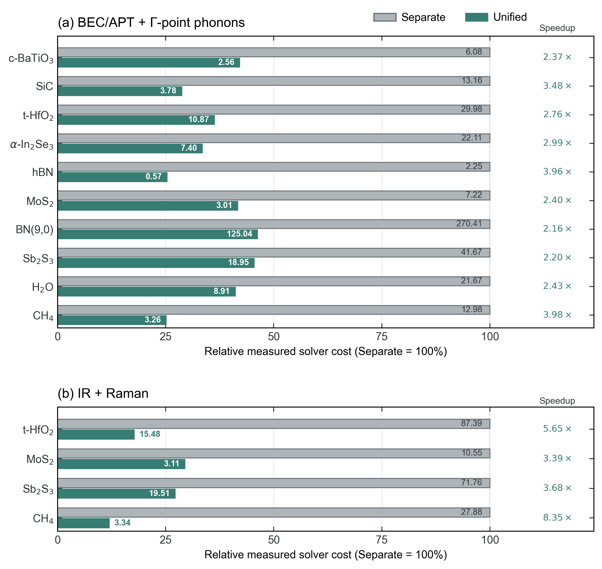

# ZStar User Manual

[简体中文](README.zh-CN.md) | [Project overview](../README.md) |
[English PDF](README.en.pdf) | [Chinese PDF](README.zh-CN.pdf)

These instructions follow the current ZStar release. Install with
`pip install zstar`. ABACUS and PYATB are external requirements for the
default route; installing the Python package does not install those solvers.

## Quick Start

Use the included two-atom 3C-SiC case for a short path from installation to
BEC, Gamma phonons, IR, and Raman results.

If you do not need to reproduce an example, `pip install zstar` is sufficient
to install and use the program. Clone the repository only when its reproducible
cases are needed:

```bash
git clone https://github.com/xdzhu/ZStar.git
cd zstar
pip install .
```

Configure ABACUS, PYATB, and MPI/OMP by following the
[calculator configuration guide](cli_reference.md#calculator-configuration),
then confirm ABACUS and PYATB with `zstar config check`.

Create a working copy and run each stage explicitly:

```bash
cd examples/3D_Bulk/SiC
cp -r run work
cd work

zstar bec pre --stru STRU
zstar bec run --dry-run
zstar bec run
zstar bec stat
zstar bec post

zstar spectra pre --root spectra --response .
zstar spectra run --root spectra
zstar spectra stat --root spectra
zstar spectra post --root spectra
```

The BEC stages prepare and execute the common displacements, then reconstruct
BEC and Gamma force constants. The spectroscopy stages obtain IR from the BEC
and modes, run the additional PYATB responses required for Raman, and write the
plots under `work/spectra/ir/` and `work/spectra/raman/`. Repeated runs resume
completed stages. The supplied PP/orbitals remain in `run/`; archived results
are in `results/`. Expect opposite Si/C BEC values near 2.70 e and a triply
degenerate optical mode near 773 cm^-1.

For agent-assisted use, install the packaged skill with `zstar skill install`,
open a new agent session, and use this prompt:

```text
Use $run-zstar-workflows to reproduce the 3C-SiC Quick Start in
examples/3D_Bulk/SiC. Run the preflight first, then execute the zstar bec and
zstar spectra stages individually if ABACUS and PYATB are available. Explain
each stage and report the BEC table, optical-mode frequencies, and spectrum paths.
```

Continue below for task selection, dimensional conventions, schedulers, other
calculators, and advanced analysis.

## Workflow overview


The workflow figure is also available as a vector PDF: [unified workflow](paper_figures/unified_workflow.pdf).

## Measured Efficiency



Paired bars report measured solver core-hours under matched electronic settings
and 40-core execution profiles. Each Separate bar is normalized to 100%,
numbers inside the bars give absolute CPU core-hours, and right-hand labels give
`Separate / Unified`.
Across ten BEC/APT plus Gamma-phonon cases, Unified is 2.16 to 3.98 times faster.
For the IR/Raman benchmark spanning bulk, slab, nanowire and molecular systems,
the measured gain is 3.39 to 8.35 times. Relaxation, failed attempts and additional validation runs are excluded
from both routes. Exact counts and timing provenance are available in the
[benchmark cases](../examples/Benchmarks/README.md) and
[figure source data](paper_figures/source_data/unified_efficiency_benchmarks.csv).

## Start With a Task

| Task | Guide | Main entry |
| --- | --- | --- |
| BEC/APT and Gamma phonons from the same calculations | [Unified BEC and phonons](research/shared_response/USAGE.md) | `zstar bec pre/run/stat/post` |
| IR and Raman from the Unified calculations | [Unified spectroscopy](unified_spectroscopy.md) | `zstar spectra pre/run/stat/post` |
| Static and frequency-dependent dielectric response | [Dielectric response](dielectric_response.md) | `zstar dielectric static/freq/optics` |
| Supercell phonons and mode labels | [Command reference](cli_reference.md#representative-lifecycles) | `zstar phonon pre/run/post/irrep` |
| Potential maps, profiles and vacuum steps | [Electrostatic potential](potential_examples.md) | `zstar pot` |
| Configure executables, MPI/OMP and PP/orbitals | [Configuration and assets](cli_reference.md#calculator-configuration) | `zstar config` |
| Shell, Slurm and Torque/PBS execution | [Job headers](job_headers.md) | `zstar bec/phonon/spectra job` |
| Agent-assisted execution | [agent skill](agent_skill.md) | `zstar skill` |

The command-reference tables list actions, not literal slash-containing commands.
For example, run `zstar bec pre --stru STRU`, then `zstar bec run`, followed by
`zstar bec post`. `job` generates a driver; it does not submit a scheduler job.

## Choose a System

| System | Physical dimension | Examples and conventions |
| --- | --- | --- |
| Bulk crystal | `--dim 3` (default) | [Bulk cases](../examples/3D_Bulk) |
| Slab, normal along z | `--dim 2` | [Slab cases](../examples/2D_Slab), [response normalization](response_conventions.md) |
| Wire, periodic along z | `--dim 1` | [One-dimensional guide](one_dimensional_workflow.md), [wire cases](../examples/1D_Nanowire) |
| Molecule | `--dim 0` | [Molecular spectroscopy](molecular_spectroscopy.md), [molecular cases](../examples/0D_Molecules) |

For `zstar bec pre`, `--dim` is the physical dimensionality. For the independent
`zstar phonon pre` command, `--dim "2 2 2"` instead specifies a supercell.
Molecules use APTs and polarizabilities; wires and slabs use their documented
line/sheet responses, not a vacuum-dependent bulk dielectric constant.

## Reproduce and Compare

- [Case library](../examples/README.md): clean `run/`, retained `results/`, and `run.sh`.
- [IR/Raman cases](../examples/IR_Raman_Spectra/README.md) and
  [potential cases](../examples/Electrostatic_Potential/README.md).
- [Ten-system BEC/phonon benchmarks](../examples/Benchmarks/README.md) and
  [four-system IR/Raman benchmarks](research/unified_spectroscopy_20260906/README.md).
- [Validation record](validation.md), [32-point-group activity audit](point_group_activity_validation.md),
  and [validation figures with source data](paper_figures/README.md).

Use the `examples/` tree in the repository for reproducible inputs and retained
results. Examples are not in the PyPI wheel or source
distribution. Dry runs, offline reconstruction and new DFT calculations are
different reproduction levels; each case README states its requirements.

**Unified** names the joint response framework; **Separate** names the old
independent workflows. `cartesian` remains a compatibility option, not the
name of the old workflow. Historical filenames and benchmark records retain
their original spelling and numerical provenance.

## Other Interfaces

Consult [backend capabilities](calculator_independent_backends.md) before using
[VASP](vasp_bec.md), [CP2K](cp2k_bec.md), or the QE adapters. Their documented
native routes do not automatically inherit ABACUS matrix reuse. See also
[High-K/BEC datasets](highk_bec_database.md), [qNEP export](qnep_dataset.md),
and [output-name compatibility](bec_output_compatibility.md).
