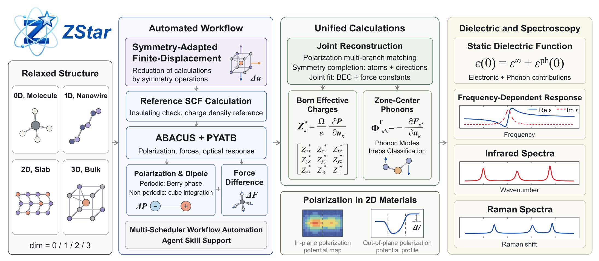

# Unified IR and Raman workflow

[Chinese](unified_spectroscopy.zh-CN.md)

This guide applies to the released ZStar 0.3.1. Install with
`python -m pip install zstar==0.3.1`; an editable source installation is not
required. See the [user manual](README.md) for configuration and example links.



The ABACUS + PYATB route now reuses one symmetry-adapted displacement ensemble
for BEC/APT, Gamma force constants, IR and static nonresonant Placzek Raman.
Raman still needs dielectric-response derivatives: it is not obtained from BECs
alone. Retained Hamiltonian, overlap and position matrices allow PYATB to evaluate
these responses without additional SCFs. The extra PYATB time is included in
the [four-dimensional cost comparison](research/unified_spectroscopy_20260906/README.md).

## Run

Activate the environment containing ZStar, Phonopy and PYATB; configure the
ABACUS launcher with `zstar config`. Start with a relaxed insulating structure
and converged inputs. Periodic direction is z for wires; slab normal is z.
Preparation sets `gamma_only=0` for PYATB matrix export even when the physical
k-point sampling consists of Gamma alone. It leaves the source INPUT unchanged.

```bash
zstar bec pre --stru STRU
zstar spectra pre
zstar spectra run
zstar spectra post
```

Use `--dim 2`, `1`, or `0` at BEC preparation for slabs, wires, or molecules.
Spectroscopy infers the dimension and geometry from the ensemble. It creates
`spectra/` separately from the electronic-response source. The run completes
missing reference/displacement stages, including the reference band-gap check,
then performs static dielectric postprocessing. Post collects the BEC and
Gamma results when they are not already available.

For a completed ensemble:

```bash
zstar spectra pre --response /path/to/completed/bec
zstar spectra run
zstar spectra stat
zstar spectra post --temperature 300 --laser 532 --broadening 8
```

The laser wavelength is in nm and the Lorentzian broadening parameter in
cm^-1. `--points` sets the spectral grid size. `--kind ir` at preparation skips
the additional dielectric-derivative stages. Missing electronic matrices produce
an actionable error; they cannot be reconstructed from BEC tables alone.

## Jobs and Restart

```bash
zstar spectra job --system slurm
```

The same [Specified / Current / Global headers](job_headers.md) and executable
configuration apply. Inspect `spectra/run_zstar_spectra.slurm` before submission.
`zstar spectra stat` reports each source SCF, polarization and Raman-static stage.
Repeated `run` calls validate and skip completed stages. Each static stage keeps
request, completion or failure records. Source/output hashes prevent silent reuse
after changes. A worker lock prevents two writers in the same workspace; only
remove a stale lock after confirming that its process has ended.

Electronic matrices and structure assets are copied into private workspaces,
never symlinked. The source BEC inputs, matrices and cubes are not overwritten.
Direct-static PYATB is used when available; older PYATB retains the zero-energy
sample from a minimal optical window. The precision adapter saves original rounded
files and full-precision tensors without changing the numerical kernels.
When PYATB belongs to another Python environment, its interpreter executes the
precision adapter from the currently installed ZStar, avoiding an older ZStar
installation in that external environment. The configured PYATB launcher must
be a direct executable command, not an opaque shell pipeline.

## Outputs and Conventions

- `ir/`: frequencies, oscillator strengths, tabulated spectrum and plots.
- `raman/`: mode tensors, Placzek activities, spectrum and atomic dielectric derivatives.
- `response.json`: machine-readable tensor units and provenance.
- `spectra_result.json`: rank/residual diagnostics and rigid-mode classification.
- `static/<stage>/`: additional PYATB calculation and integrity records.

Atomic dielectric derivatives are fitted using actual written displacement
vectors. All three tensor indices transform under symmetry. Contraction with
mass-weighted eigenvectors uses factors 1 (bulk), Lz (slab), A/(4 pi) (wire),
or V/(4 pi) (molecule), consistent with the existing
[response conventions](response_conventions.md). The cell is fixed. Molecular
IR uses APT-derived dipole derivatives without dividing by the supercell volume.
Raman sum-rule residuals are reported without silently projecting them away.
Rigid translations/rotations are separated by mass-weighted overlaps; unstable
internal modes or ambiguous rigid-mode mixing stop collection.

## Separate Controls and Examples

`zstar spectra pre --method mode --stru STRU --qpoints qpoints.yaml` retains
normal-mode finite differences. VASP, CP2K and QE retain their documented native
workflows; they are not silently converted to the ABACUS ensemble algorithm.
The Unified route does not imply resonant Raman or full phonon dispersions.

The four reference cases are under `examples/IR_Raman_Spectra/`:
`Bulk_HfO2`, `2D_MoS2`, `Nanowire_Sb2S3`, and `Molecule_CH4`.
Each has clean `run/` inputs with PP/orbitals, retained `results/`, and `run.sh`.
`bash run.sh --dry-run` previews commands; `bash run.sh` uses Unified by default;
`bash run.sh --method mode --work mode_control` selects the independent route.
Use a fresh work directory when changing the sampling method. Existing result
archives are immutable references, not directories for new calculations.

Offline reconstruction validates the response processing, not a new SCF or
convergence study. Full runs require the external ABACUS and PYATB installations.
File-only spectrum plotting does not require a GUI or Tcl/Tk installation.
